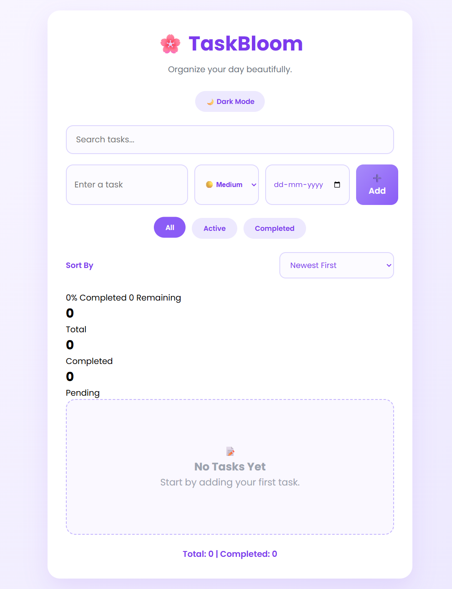
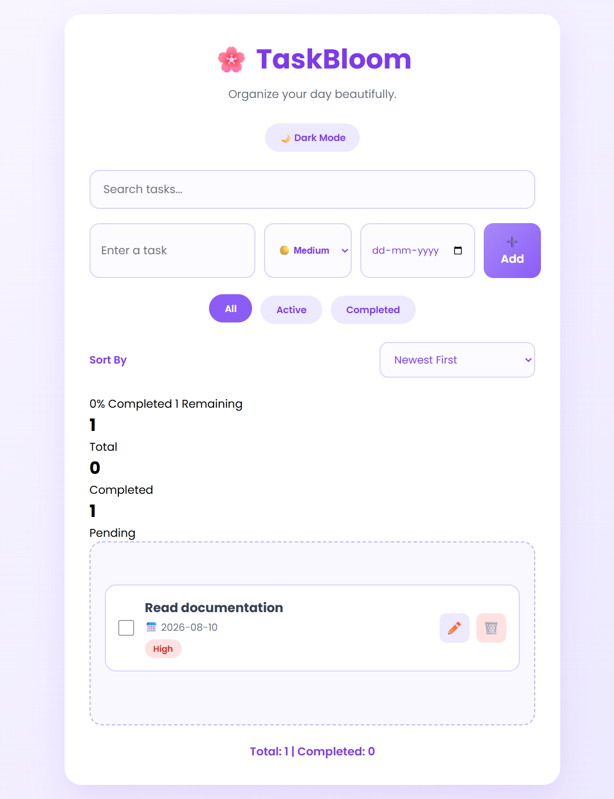

# Modern To-Do Manager

A modern task manager web app built with HTML, CSS, and JavaScript.

## Features

- Add tasks with priority and due date
- Search tasks live
- Filter tasks: All / Active / Completed
- Sort tasks by newest, oldest, priority, or due date
- Edit and delete tasks
- Light/Dark theme toggle
- Persistent storage using `localStorage`

## Files

- `index.html` — main page layout
- `style.css` — application styling
- `script.js` — task app functionality

## Run locally

1. Open `index.html` in a browser.
2. Add tasks and use the controls.

## Screenshots

### Homepage

### Task added

## Notes

- The app stores tasks locally in the browser.
- Deleting browser data will remove saved tasks.
